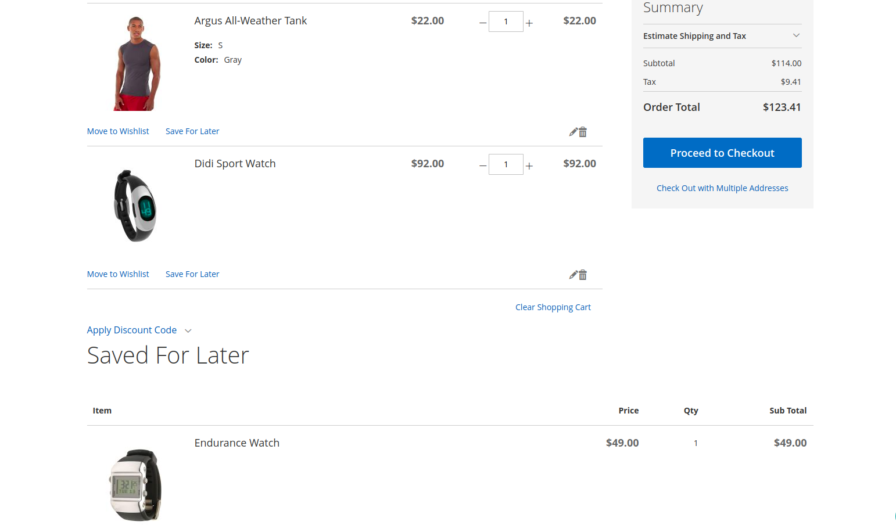
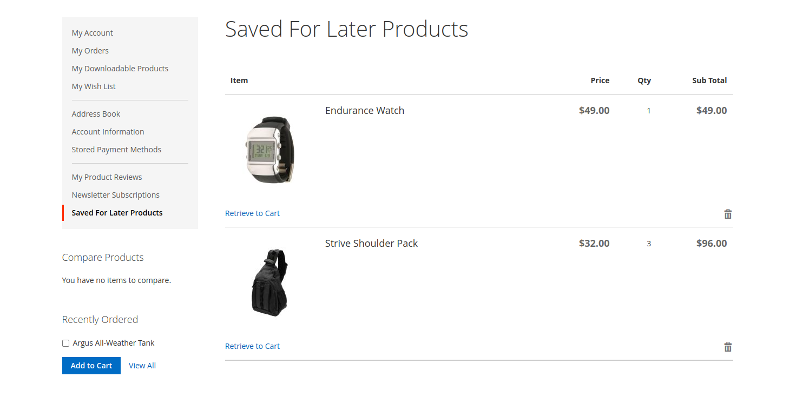

# M2Commerce Commerce: Magento 2 Save For Later

## Overview
An optimized shopping experience is the key to increase the conversion rates of your store. This extension enables you to display a “Save For Later” option in the Checkout Cart page. When you add the product to the Save For Later, it gets removed from the shopping cart. This extension allows your registered customers to save the products they are interested in, so they can place the order later while standing on cart page.
The items are saved in the Saved For Later tab in the customer dashboard as well. With the retrieve to cart option, it takes the items directly to the checkout page.

### Features

```
1. Allows customers to save the products of their choice on cart page.
2. Works for all kind of products, i.e virtual, simple, configurable, bundle, group and downloadable.
3. Enable/disable the “Save For Later” from admin
4. When disabled the grid and the Save For Later tab in the customer dashboard vanishes.
5. Save For Later is only for registered (logged in) users. 
6. Increase the leads because it encourages the customers to sign up on your store.
```

## Configuration

There are several configuration options for this extension, which can be found at **STORES > Configuration > Commerce Enterprise > Save For Later**.

### ScreenShots



## Installation
### Magento® Marketplace

This extension will also be available on the Magento® Marketplace when approved.

1. Go to Magento® 2 root folder
2. Require/Download this extension:

   Enter following commands to install extension.

   ```
   composer require m2commerce/save-for-later
   ```

   Wait while composer is updated.

   #### OR

   You can also download code from this repo under Magento® 2 following directory:

    ```
    app/code/M2Commerce/SaveForLater
    ```    

3. Enter following commands to enable the module:

   ```
   php bin/magento module:enable M2Commerce_SaveForLater
   php bin/magento setup:upgrade
   php bin/magento setup:di:compile
   php bin/magento cache:clean
   php bin/magento cache:flush
   ```

4. If Magento® is running in production mode, deploy static content:

   ```
   php bin/magento setup:static-content:deploy
   ```
